# Stock Monitoring Dashboard

## Table of Contents
- [Stock Monitoring Dashboard](#stock-monitoring-dashboard)
  * [Components](#components)
  * [High-Level Architecture](#high-level-architecture)
  * [Installation Requirements](#installation-requirements)
- [Deployment](#deployment)
  * [Local Deployment](#local-deployment)
    + [Install the Amplify CLI](#install-the-amplify-cli)
    + [Clone the repo from GitHub](#clone-the-repo-from-github)
    + [Initialize the Project](#initialize-the-project)
    + [Deploy the Backend](#deploy-the-backend)
    + [Install frontend dependencies](#install-frontend-dependencies)
  * [Deploy Application using Amplify Console](#deploy-application-using-amplify-console)
- [Setup the Data Feed Integration](#setup-the-data-feed-integration)
  * [Where to get Config Values?](#where-to-get-config-values-)
    + [Local Deployment](#local-deployment-1)
    + [Amplify Console](#amplify-console)
  * [Register for an API Key from the Data Feed Provider](#register-for-an-api-key-from-the-data-feed-provider)
  * [Create Cognito User Pool Client for the Backend](#create-cognito-user-pool-client-for-the-backend)
  * [Create Backend User](#create-backend-user)
  * [Create Secrets Manager Entries](#create-secrets-manager-entries)
  * [Configure the Backend Lambda](#configure-the-backend-lambda)
  * [Deploy via CloudFormation](#deploy-via-cloudformation)
- [Testing](#testing)

## Components

This demo application consists of the following components:

* The frontend is built using React JS
* The backend is using AWS AppSync via AWS Amplify Framework
* Authentication is done via Amazon Cognito
* AWS Secrets Manager is used to store the API Keys that will be used to query the data feed.
* AWS Lambda and Amazon CloudWatch Events are used to regularly fetch the latest Intraday prices from the data feed.
* The data feed that this demo uses is from [Alpha Vantage](https://www.alphavantage.co)

## High-Level Architecture

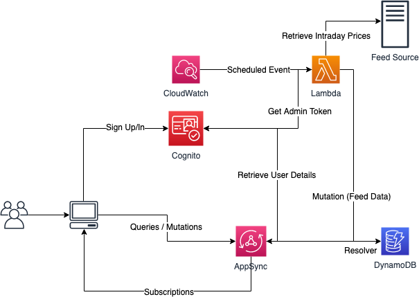

## Installation Requirements

1. AWS CLI (>= 1.16.234)
2. Amplify CLI (>= 1.11.0)

# Deployment
You can either deploy it locally or use [AWS Amplify](https://aws.amazon.com/amplify/) to host the application for you. The succeeding sections describes both approaches so you only need to pick one.

## Local Deployment

### Install the Amplify CLI

```bash
npm install -g @aws-amplify/cli
```

### Clone the repo from GitHub

```bash
git clone https://github.com/jmgtan/stock_dashboard.git
```

### Initialize the Project

```bash
cd stock_dashboard
amplify env add
```

Use the following values:

* Do you want to use an existing environment? No
* Enter a name for the environment. You can just input "local"
* Do you want to use an AWS profile? If you have a profile configured via the AWS CLI, you can reuse the same profile, otherwise choose No and configure accordingly.

### Deploy the Backend

```bash
amplify push
```

Just use the default answers and follow the instructions.

The push commands will create the following:
* Cognito User Pool
* DynamoDB
* AppSync API

### Install frontend dependencies

```bash
npm install
```

## Deploy Application using Amplify Console

Execute the following CloudFormation to create the `AmplifyBackendDeploymentRole` service role that would be used by Amplify.

```bash
aws cloudformation deploy --template-file bootstrap/amplify-console-base-cf.yaml --stack-name StockDashboardBase --capabilities CAPABILITY_NAMED_IAM
```

Alternatively, you can go to the IAM console and create a new role that has the following permissions (make sure that it has a trust relationship with Amplify (amplify.amazonaws.com).):

```json
{
    "Version": "2012-10-17",
    "Statement": [
        {
            "Action": [
                "s3:*",
                "codecommit:*",
                "appsync:*",
                "dynamodb:*",
                "cloudformation:*",
                "iam:*",
                "cognito-idp:*",
                "cognito-identity:*",
                "sns:*",
                "lambda:*",
                "amplify:*"
            ],
            "Resource": "*",
            "Effect": "Allow"
        }
    ]
}
```

Login to your Github account and fork the repository:

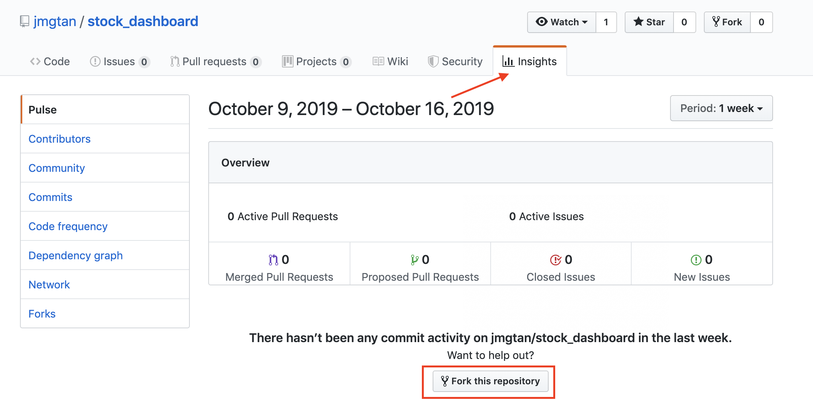

Alternatively, you can clone the repository and push it to either Github or CodeCommit.

Go to the AWS Management Console and then Amplify. Click "Get Started" under "Deploy", see following screenshot:

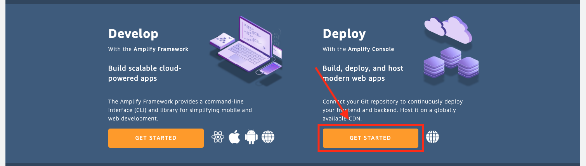

You should be able to see a screen like the following:

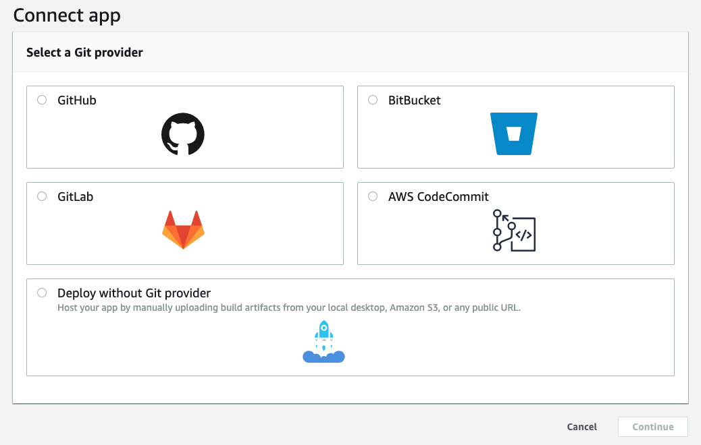

Once your repo has been selected, Amplify should automatically generate a build configuration. Make sure to select "Create new environment":

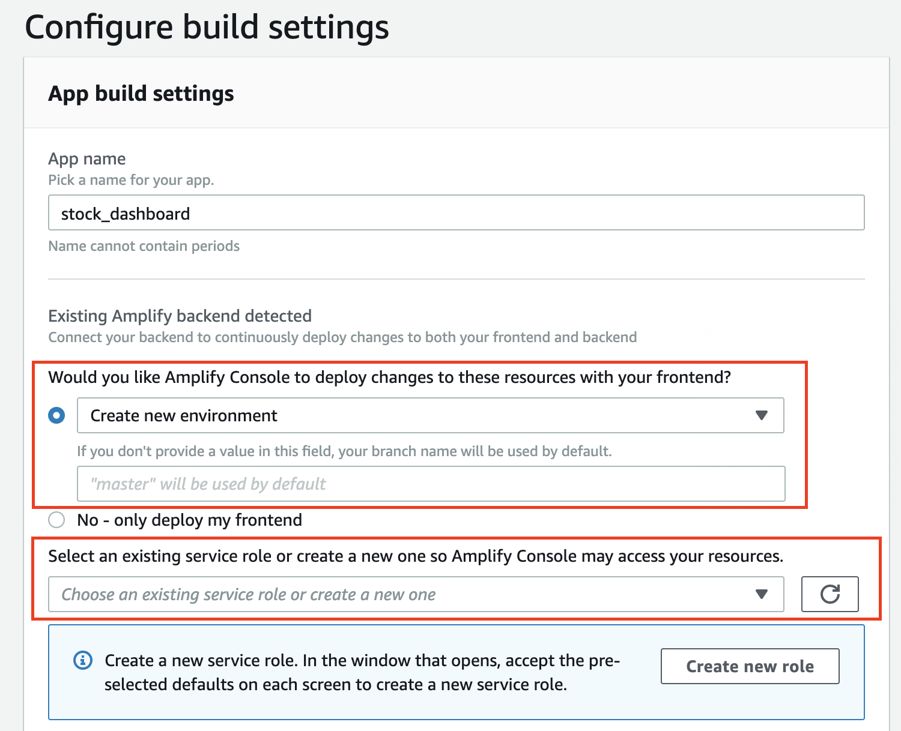

Select the role (`AmplifyBackendDeploymentRole`) that was created by the bootstrap CloudFormation template and then click "Next". This will automatically deploy both frontend and backend. You can keep track of the deployment process by drilling down and see the logs that are being streamed in.

Once the deployment finishes, there's one more step to make sure that the React Router works. Go to the "Rewrites and redirects" section:

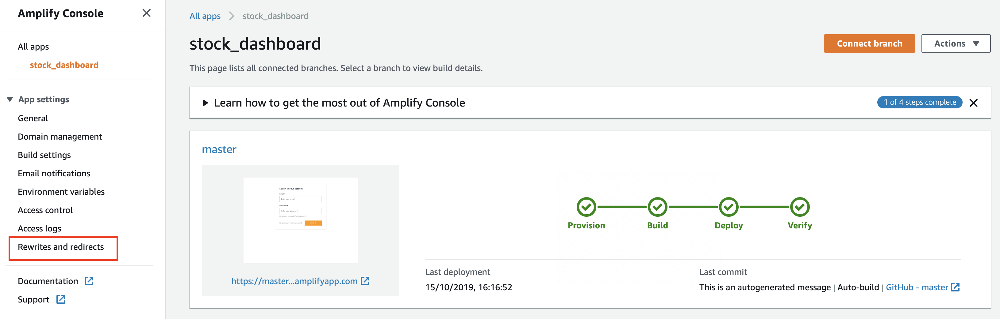

Modify the default rule and change the "Source address" to `</^((?!\.(css|gif|ico|jpg|js|png|txt|svg|woff|ttf)$).)*$/>`, and the "Type" to `200 (Rewrite)`, it should look like this:

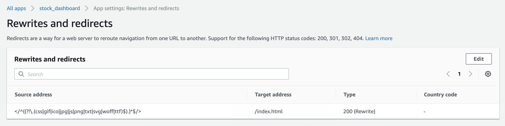

# Setup the Data Feed Integration

## Where to get Config Values?

### Local Deployment
After running `amplify push` in the previous step, the `src/aws-exports.js` file would be generated. Refer to that file to get the config values for the data feed function.

### Amplify Console
Since the deployment is handled by the Amplify service, you won't have access to the config file. You would be able to get the config values by going to the different services that the app depends on. These are as follows:
- Go to Cognito console to get the pool id.
- Go to AppSync to get the endpoint url.

## Register for an API Key from the Data Feed Provider

Go to [Alpha Vantage](https://www.alphavantage.co), and get a free API key.

## Create Cognito User Pool Client for the Backend

```bash
aws cognito-idp create-user-pool-client --user-pool-id <value of user pool id> --client-name BackendClient --explicit-auth-flows "ADMIN_NO_SRP_AUTH"
```

Take note of the return payload, specifically the `ClientId`.

## Create Backend User

We're going to create a new user in the user pool specifically for the use of the backend Lambda function to be able to call the AppSync mutation APIs.

```bash
aws cognito-idp admin-create-user --user-pool-id <value of user pool id> --username "<email of new admin user>" --user-attributes=Name=email,Value="<email of new admin user>" --message-action "SUPPRESS"

aws cognito-idp admin-set-user-password --user-pool-id <value of user pool id> --username "<email of new admin user>" --password "<password>" --permanent
```

Remember the email and password for the admin user, the next step is to store these values in AWS Secrets Manager for the backend Lambda function to consume.

## Create Secrets Manager Entries

Create entry for the backend user account

```bash
aws secretsmanager create-secret --name "stockMonitoring/<env>/backend" --secret-string '{"username": "<backend username>", "password": "<backend password>"}'
```

Create entry for the data feed API key

```bash
aws secretsmanager create-secret --name "stockMonitoring/<env>/datafeed" --secret-string '{"feed_api_key": "<feed api key>"}'
```

## Configure the Backend Lambda

Open the file `processors/GetIntradayPrices/config-exports.js`

Update the following values:

* `cognito_pool_id`: use the value from the file `src/aws-exports.js` in the `aws_user_pools_id` variable
* `cognito_backend_client_id`: use the value from the `ClientId` of the backend client that was created in the previous section.
* `cognito_backend_access_key`: value is `stockMonitoring/<env>/backend`
* `appsync_endpoint_url`: use the value from the file `src/aws-exports.js` in the `aws_appsync_graphqlEndpoint` variable
* `appsync_region`: use the value from the file `src/aws-exports.js` in the `aws_appsync_region` variable
* `data_feed_key`: value is `stockMonitoring/<env>/datafeed`

## Deploy via CloudFormation

Create S3 bucket to serve as the staging area for deploying the Lambda function. This will be used by the AWS CloudFormation package command.

```bash
aws s3api create-bucket --bucket <staging bucket name> --create-bucket-configuration LocationConstraint=eu-west-1
```

Next we should install the dependencies that the function requires, do the following:

```bash
cd processors/GetIntradayPrices
npm install
```

Next we package and stage the Lambda function

```bash
cd ..
aws cloudformation package --template-file cf-template.yaml --s3-bucket <staging bucket name> --output-template-file packaged-template.yaml
```

Once the command succeeds you can then execute the deploy command

```bash
aws cloudformation deploy --template-file packaged-template.yaml --stack-name <stack name> --capabilities CAPABILITY_IAM
```

Once deployment completes, going to the CloudFormation console and into the stack, you should be able to see the list of resources that were created

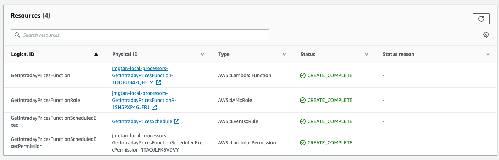

Clicking the Lambda function, you should be able to see the trigger, which is a CloudWatch scheduled event for every 30 mins.

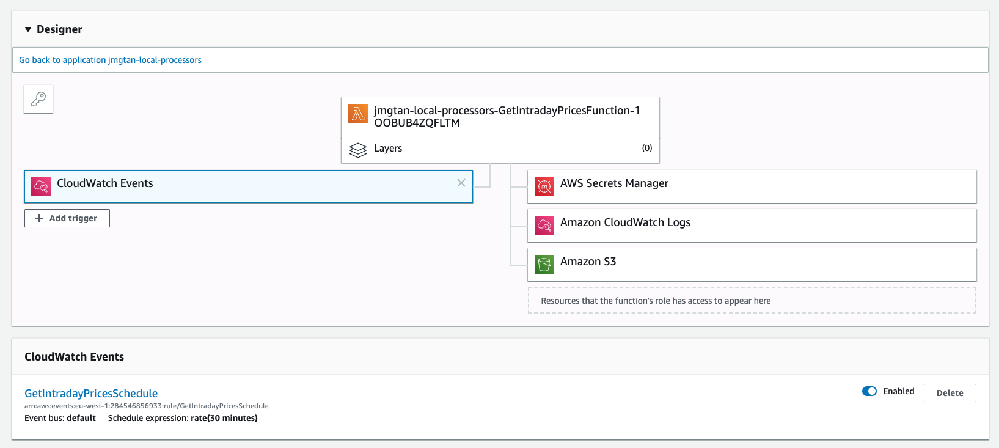

# Testing

If you deployed the application locally, you can start the server using the following command

```bash
npm start
```

This command would automatically open the browser. 

Alternatively, if you deployed via the Amplify Console, you can open the application using the URL generated from Amplify Console.

If this is your first time accessing the application, you should create a new account and validate it. Once you're logged in you can start adding stock symbols to monitor. See the following screenshot:

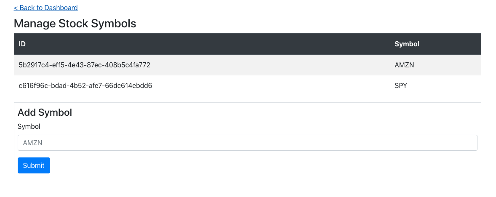

You can then either wait for the Lambda function to trigger to start populating the data, or you can manually trigger. See the following screenshots on how to manually trigger:

Go to the console and look for the Lambda function that was created by the CloudFormation template, click test:

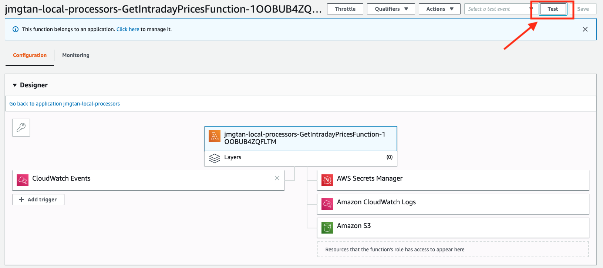

The Lambda function doesn't really need any payload, so you can just pass in an empty JSON document

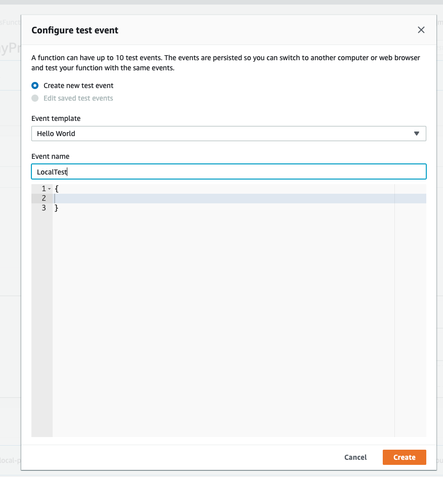

Once the test event has been created, you can click the Test button again and it should trigger the function. If you have the application open in the browser, you should be able to see the data streaming in via the chart that are automatically updated. For example:

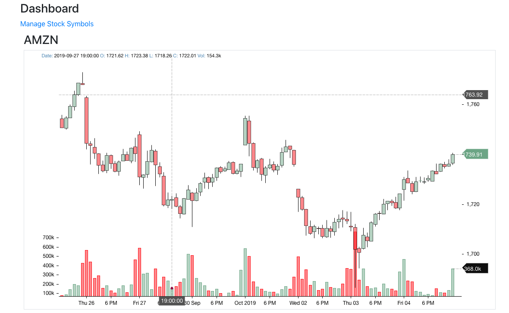
